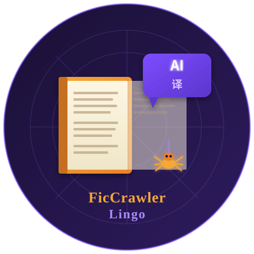

[中文版](README_zh.md)

# FicCrawler&Lingo



A Rust CLI tool that scrapes [Archive of Our Own](https://archiveofourown.org) fanfiction works into **Markdown** and **study-ready HTML** files with built-in translation/vocabulary slots designed for use with LLMs.

## Features

- Scrapes any AO3 work by URL (multi-chapter supported)
- Preserves formatting: **bold**, *italic*, ~~strikethrough~~, headings, horizontal rules, links, blockquotes, lists, tables, images
- Extracts full metadata: rating, warnings, categories, fandoms, relationships, characters, tags, stats (kudos, bookmarks, hits, word count, etc.), summary, author notes
- Generates **study HTML** with per-paragraph translation slots (translation, vocabulary, chunks)
- Auto-generates an **LLM prompt template** (`prompt.txt`) for translation & vocabulary analysis
- Retry with exponential backoff on timeout / 5xx / 429 errors, with live countdown display
- Progress bar with real-time status
- Cloudflare bypass via browser cookie file (`--cookies`)

## Installation

```bash
git clone <this-repo>
cd EnglishReading
cargo build --release
```

Binary will be at `target/release/ao3-scraper`.

## Usage

```bash
# Basic — scrapes to ./books/<WorkTitle>/
ao3-scraper "https://archiveofourown.org/works/27526954/chapters/67317511"

# With browser cookies (required if Cloudflare blocks you)
ao3-scraper "https://archiveofourown.org/works/12345" --cookies ~/ao3_cookies.txt

# Custom output directory
ao3-scraper "https://archiveofourown.org/works/12345" -o my-reading

# All options
ao3-scraper <URL> [OPTIONS]
  -o, --output <DIR>      Output directory (default: books)
  -d, --delay <MS>        Delay between requests in ms (default: 1500)
  -r, --retries <N>       Max retry attempts per request (default: 5)
  -t, --timeout <SECS>    Request timeout in seconds (default: 60)
      --cookies <FILE>    Netscape-format cookies.txt from browser (for Cloudflare bypass)
```

### Cloudflare / 525 errors

AO3 uses Cloudflare which may block automated requests with a 525 SSL error. To work around this, export your browser's cookies for `archiveofourown.org` and pass them with `--cookies`:

1. In Firefox, install the [cookies.txt](https://addons.mozilla.org/en-US/firefox/addon/cookies-txt/) extension
2. Log in to AO3 in your browser
3. Click the extension icon on an AO3 page → **Export** → save as `ao3_cookies.txt`
4. Run: `ao3-scraper <URL> --cookies ~/ao3_cookies.txt`

> Note: `__cf_bm` cookies expire after a few minutes. Re-export if you get 525 errors again.

## Output Structure

```
books/
└── Work Title/
    ├── metadata.md          # Work metadata in Markdown
    ├── metadata.html        # Work metadata as styled HTML
    ├── prompt.txt           # LLM prompt template
    ├── chapter1.md          # Chapter 1 Markdown
    ├── chapter1.html        # Chapter 1 study HTML with translation slots
    ├── chapter2.md
    ├── chapter2.html
    └── ...
```

## Study HTML Format

Each chapter HTML file features:

- Clean, responsive design with dark mode support
- Each paragraph wrapped in a **study block** containing:
  1. **Original text** — the English paragraph
  2. **Translation slot** — empty area for Chinese translation
  3. **Vocabulary section** (collapsible) — slots for word definitions (part of speech, IPA phonetic, meaning, example)
  4. **Chunks section** — slots for useful collocations and phrases
- Chapter navigation (previous / next / index)

### Using with LLMs — Manual

1. Open `prompt.txt` — it contains a ready-to-use prompt
2. Copy the prompt into any LLM (ChatGPT, Claude, Gemini, DeepSeek, Kimi, etc.)
3. Then paste the content of a `chapterN.md` file after the prompt
4. The LLM will output structured translation + vocabulary + chunks for every paragraph
5. Fill the results into the corresponding `chapterN.html` slots

The prompt is designed to work with **any major LLM** and produces consistent, structured output.

### Using with Claude API — Automated (`translator/`)

The `translator/` module automates the above process end-to-end using the **Claude API** (requires an Anthropic API key):

```bash
cd translator
python3 -m venv .venv
.venv/bin/pip install -r requirements.txt

export ANTHROPIC_API_KEY=sk-ant-...
# OR
export ANTHROPIC_API_KEY=$ANTHROPIC_AUTH_TOKEN

# Translate all chapters of a book
.venv/bin/python translate.py "../books/A Ruinous Gift"

# Single chapter only
.venv/bin/python translate.py "../books/A Ruinous Gift" --chapter 1
```

- Splits each chapter into batches of 15 paragraphs per API call
- Saves progress to `chapter{N}.progress.json` after each batch — safe to interrupt and resume
- Patches translation/vocabulary/chunks directly into `chapter{N}.html`

See [`translator/README.md`](translator/README.md) for full details.

## Translation Slot Structure

Each paragraph block in the HTML:

```
┌─────────────────────────────────┐
│  Original English paragraph     │
├─────────────────────────────────┤
│  Translation / 翻译              │  ← Fill with LLM output
│                                 │
│  ▸ Vocabulary & Chunks          │  ← Collapsible
│    word (pos) /IPA/ — meaning   │
│      Example: ...               │
│    Chunks: phrase — meaning     │
└─────────────────────────────────┘
```

## Requirements

- Rust 1.70+ (tested with 1.95-nightly)
- `curl` (system curl, must be in PATH)
- Internet access to archiveofourown.org

## License

MIT
